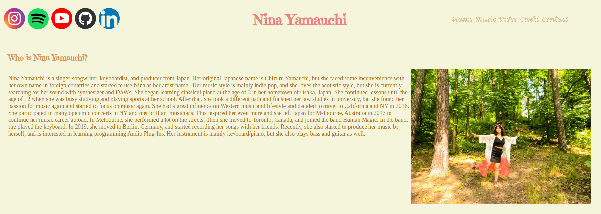
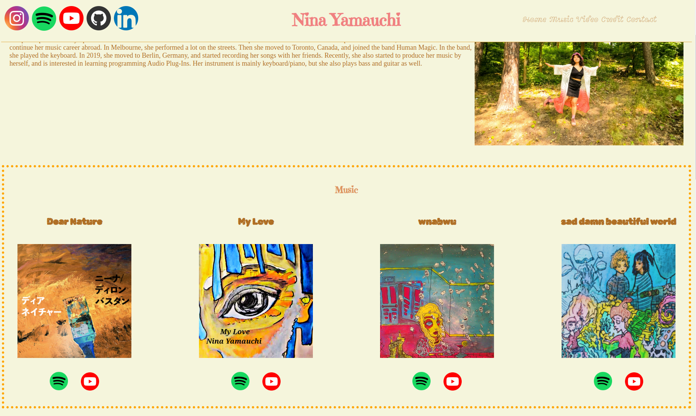
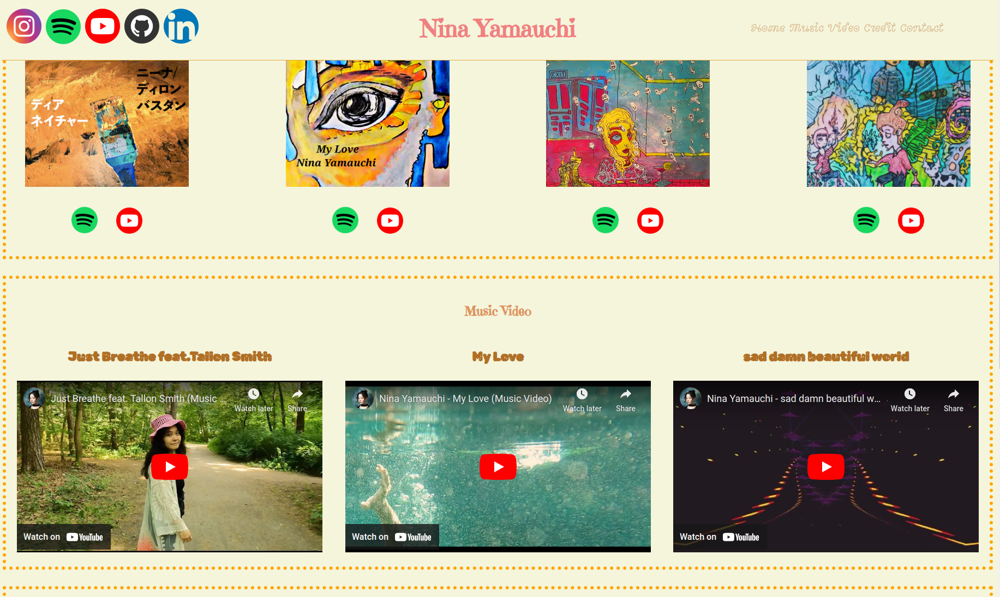
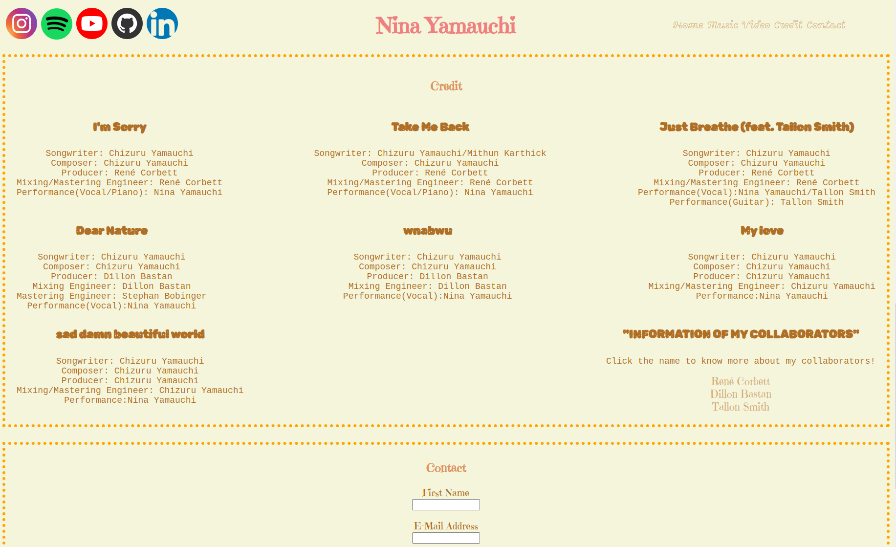
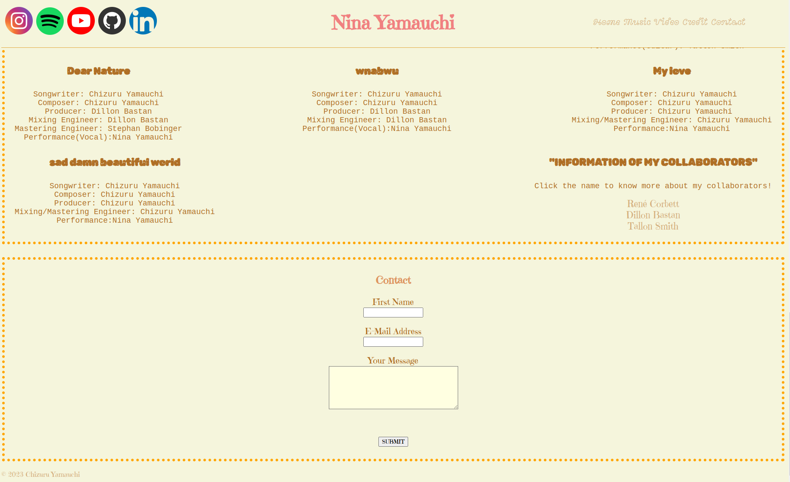

# My portfolio project

## First of all

This is a portfolio project and I have already worked on another portfolio project back in July 2023.
Therefore, I uploaded many files with one git push at the beginning.
But I added the new icons in the header, videos and photos in music/music vdieo sections, and credit section in addition to my old project.

## The final result(How it looks)

## Things I used in this project.
HTML, CSS, Git, GitHub, Markdown

## Contact
Please contact me via [Linkedin](https://www.linkedin.com/in/chizuru-nina-yamauchi-3772b4116/) or from another social media.

